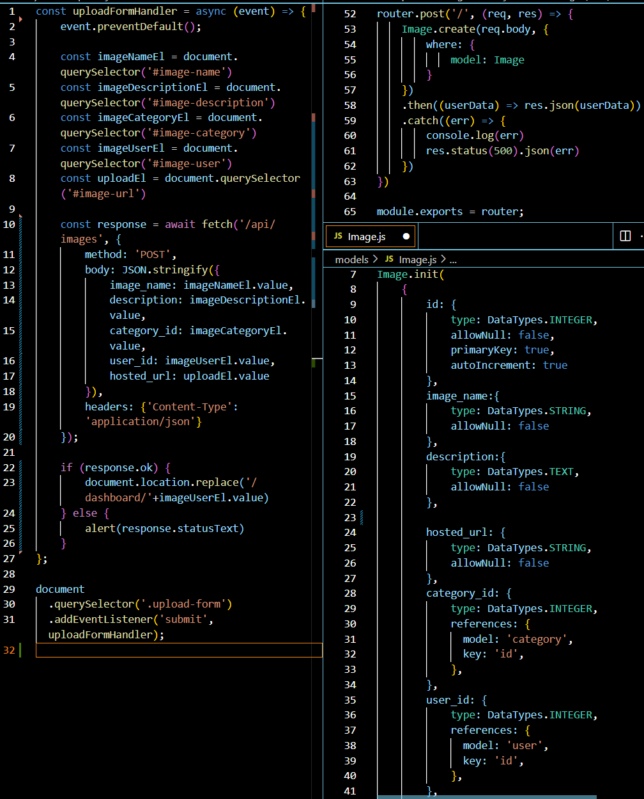
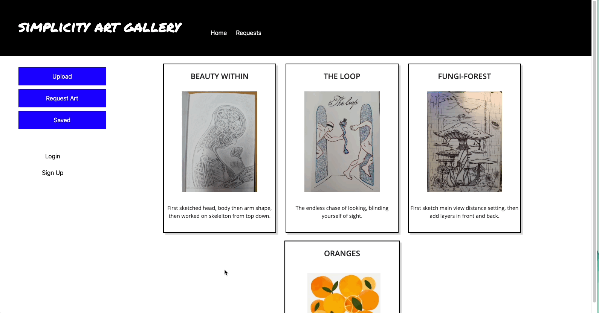

# Art-gallery
# Simplicity Art Gallery

## Description

This full-stack web application creates a versatile art gallery built using html, css, and javascript. Art gallery allows a user to upload photos and see photos from other users. Users can sign up, login and start sharing photos, comment on photos, and request art from the community. 

It’s built using MVC and mysql with routes for users, images, comments, requests, and homepage. It also incorporates Cloudinary for image hosting. The Cloudinary hosted url is then used to render images to the site. 

Deployed Link: https://simplicity-art-gallery.herokuapp.com/

## Table of Contents

* [Installation](#installation)
* [Usage](#usage)
* [Credits](#credits)
* [License](#license)
* [Contributing](#contributing)
* [Tests](#tests)
* [Questions](#questions)


## Installation

   "bcrypt": "^5.0.1",
   "cloudinary": "^1.30.1",
   "connect-session-sequelize": "^7.1.4",
   "dotenv": "^16.0.1",
   "express": "^4.18.1",
   "express-handlebars": "^6.0.6",
   "express-session": "^1.17.3",
   "formidable": "^2.0.1",
   "mysql2": "^2.3.3",
   "nodemon": "^2.0.19",
   "sequelize": "^6.21.3"


## Usage

Art gallery is built on HTML, CSS, and Javascript. When an image is uploaded via Cloudinary, it’s automatically rendered and appended to the homepage gallery view. A single page route using uploaded image id is created as well so every image can be viewed individually. 

On a single image page, comments can be entered into a form and submitted using the submit button. When the button is clicked, the comment is immediately shown on the page in the comments section.

Only .jpg and .png files are supported within this app. 


## Code Snippet
### User-routes
The code here shows the route and backend of creating a user -- AKA signing up! To start, we used an async-await promise function and created a variable function based off our User model. The three attributes that are needed are a username, email, and password, and within those the the values of the client-side data inputted into the sequelize data. Then, using cookies, the function will upload the user’s data if it works, or send over an error message if not. 
```
router.post('/', async (req, res) => {
    try {
        const userData = await User.create({
          username: req.body.username,
          email: req.body.email,
          password: req.body.password
        });
   
        req.session.save(() => {
          req.session.user_id = userData.id;
          req.session.logged_in = true;
   
          res.json(userData);
        });
      } catch (err) {
        res.status(400).json(err);
      }
})

```
### Upload Form
The left column shows the js file that listens for a submit button click, to run a function that listens for the input in the upload form and creates a new image model with the js code on the right.



### Cloudinary Upload Widget

The following code is used in an html file with the form to capture image details. 
```
​​<script src="https://upload-widget.cloudinary.com/global/all.js" type="text/javascript"></script>
 
<script type="text/javascript">
   let urlInfo = "";
   const uploadUrl = document.querySelector('#image-url')
   var myWidget = cloudinary.createUploadWidget({
       cloudName: '',
       uploadPreset: ''
   }, (error, result) => {
       if (!error && result && result.event === "success") {
           console.log('Done! Here is the image info: ', result.info.url);
           urlInfo = result.info.url;
           uploadUrl.value = urlInfo;
       }
   }
   )
 
   document.getElementById("upload_widget").addEventListener("click", function () {
       myWidget.open();
   }, false);
</script>
 
Upload button: <button id="upload_widget" class="cloudinary-button">Choose an Image</button>
 ```


## License
MIT License

Copyright (c) 2022 dylankreisman

Permission is hereby granted, free of charge, to any person obtaining a copy
of this software and associated documentation files (the "Software"), to deal
in the Software without restriction, including without limitation the rights
to use, copy, modify, merge, publish, distribute, sublicense, and/or sell
copies of the Software, and to permit persons to whom the Software is
furnished to do so, subject to the following conditions:

The above copyright notice and this permission notice shall be included in all
copies or substantial portions of the Software.

THE SOFTWARE IS PROVIDED "AS IS", WITHOUT WARRANTY OF ANY KIND, EXPRESS OR
IMPLIED, INCLUDING BUT NOT LIMITED TO THE WARRANTIES OF MERCHANTABILITY,
FITNESS FOR A PARTICULAR PURPOSE AND NONINFRINGEMENT. IN NO EVENT SHALL THE
AUTHORS OR COPYRIGHT HOLDERS BE LIABLE FOR ANY CLAIM, DAMAGES OR OTHER
LIABILITY, WHETHER IN AN ACTION OF CONTRACT, TORT OR OTHERWISE, ARISING FROM,
OUT OF OR IN CONNECTION WITH THE SOFTWARE OR THE USE OR OTHER DEALINGS IN THE
SOFTWARE.

## Contributing
Dylan Kreisman: 
- (https://github.com/dylankreisman)
- (https://www.linkedin.com/in/dylan-kreisman-3752b1160/)

Shmuel Hoffman:
- [E-mail: Snyh121@gmail.com](mailto:snyh121@gmail.com)  
- [GitHub: snyh212](https://github.com/snyh212)  
- [LinkdIn: Shmuel-Hoffman](https://www.linkedin.com/in/shmuel-hoffman-254b0223b?lipi=urn%3Ali%3Apage%3Ad_flagship3_profile_view_base_contact_details%3BS2rg0PtBTLeG2szT2ZbGmg%3D%3D)

Mary Dillon: 
- Github: (https://github.com/mardill)
- LinkedIn: (https://www.linkedin.com/in/marykdillon/) 

## GIF of Deployed App


### Login


### Sign-up and upload image


### Comment
